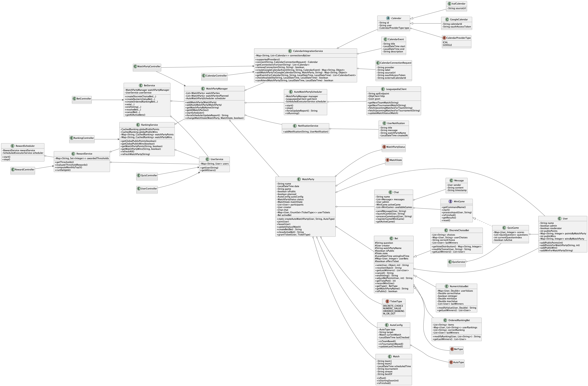

  <!-- Présentation -->

# Projet
## Nom
/alll en référence aux premières lettres de nos prénoms et /all couramment utilisé pour désigner l’ensemble des personnes présentes dans une room.

## Objectif
L’objectif est de proposer un environnement interactif autour d’un match e‑sport, en combinant plusieurs fonctionnalités dont des paris par exemple. L’application vise à offrir une expérience immersive et communautaire.

## Personnes concernées 
La plateforme s’adresse aux spectateurs de matchs e-sport afin de profiter de ces matchs avec des amis, ou même rencontrer d'autres personnes partageant la même passion.
  

# Concurrents
- **Discord** : Plateforme de communication très complète (chat, vocal, salons privés). Elle ne propose pas nativement de paris, de watch parties automatisées ou d’intégration e‑sport. Les fonctionnalités e‑sport doivent être ajoutées via bots externes.
- **Twitch** : Plateforme de streaming avec chat intégré. Elle propose des extensions interactives, pas de watch parties automatisées basées sur des APIs e‑sport, et pas de mini‑jeux intégrés au chat.

| | Notre projet |Discord |Twitch |
|-|-|-|-|
|Chat structuré (public/privé)|Oui         |Oui            |Oui|
|Paris          |Oui          |Non via bots           |Oui
|Watch Parties automatiques          |Oui|Non|Non
  |Mini-jeux          |Oui quiz integré|Non via bots|Non
|Classement        |Oui |Non via bots|Non

# Diagramme de classe

# Fonctionnalités
## WatchParty
### Ce que ça fait :
Une watchparty est automatiquement créée lorsqu’un match e‑sport est détecté comme étant à venir. Chaque watchparty regroupe plusieurs éléments : une chatroom dédiée, une liste d’utilisateurs participants et un système de points permettant d’interagir avec les paris et les mini‑jeux. Les utilisateurs peuvent rejoindre la watchparty avant le début du match, suivre son évolution en temps réel et participer aux différentes activités proposées.

## Chat
### Ce que ça fait :
Le système de chat repose sur deux types d’espaces : les chats publics et les chats privés. Chaque watchparty possède son propre chat, accessible uniquement aux utilisateurs qui y participent. Quelques minutes avant le début du match, les participants peuvent commencer à échanger, envoyer des messages, réagir et participer à des mini‑jeux intégrés. Le chat devient ainsi un espace central d’interaction sociale autour de l’événement, renforçant l’aspect communautaire de la plateforme.

## Pari
### Ce que ça fait :

Le système de paris est étroitement lié aux watchparties. Lorsqu’un match est en cours, des paris peuvent être proposés aux utilisateurs, qu’ils soient publics ou privés selon le type de watchparty. Chaque utilisateur dispose d’un nombre de points, propre à chaque watchparty, qu’il peut miser. En cas de victoire, les gains sont automatiquement calculés en fonction du pot total et de la proximité entre la réponse du parieur et la bonne réponse (pour les paris dit à classement et à valeur numérique). Les paris sont limités dans le temps, ce qui ajoute une dimension stratégique.
Trois types de paris sont disponibles :
-   les paris à réponse fermée avec choix, où l’utilisateur sélectionne une option parmi plusieurs propositions ;
-   les paris à réponse fermée avec classement, où l’utilisateur doit fournir une liste ordonnée (par exemple, les joueurs selon leur performance) ;
-   les paris à réponse ouverte, où l’utilisateur saisit une valeur numérique.
Deux systèmes de points coexistent : un système public et un système privé, permettant d’adapter les paris au contexte de la watchparty.

### Difficulté :

Implémenter la logique de répartition des gains après certains paris (notamment pour les listes et valeur numérique)

## Récompenses
### Ce que ça fait :
Le système de récompenses combine progression, paris et classement : au fil des watchparty publiques, les joueurs cumulent des points qui cumulent de manière globale leur permettant de franchir des paliers (1000, 5000, 10 000, etc.) qui déclenchent l’option de  récupération de récompenses. Certains paris spéciaux peuvent offrir des tickets : une fois gagnés, ces tickets permettent d’agir sur un pari en attente (IN_OR_OUT pour ajuster sa mise, ou un ticket lié au type de pari pour influer sur la valeur soumise). Enfin, chaque fin de mois, le top 3 du classement global (points et victoires de paris) reçoit des récompenses mensuelles, valorisant à la fois la régularité et la performance sur les paris.

### Difficulté :

Trouver les bonnes récompenses à offrir pour satisfaire les utilisateurs
## Lien avec un événement e-sport
### Ce que ça fait :
L’application est directement connectée à une API spécialisée dans les compétitions de _League of Legends_. Elle récupère automatiquement les matchs à venir et crée les watchparties correspondantes. Cette automatisation permet d’assurer une synchronisation totale entre l’événement réel et la plateforme, sans intervention manuelle. Les utilisateurs peuvent ainsi suivre les matchs en temps réel et interagir dès qu’un nouvel événement est détecté.

# Critères du Done
Une fonctionnalité est considérée comme terminée lorsqu’elle dispose d’une API REST fonctionnelle, testée via des tests unitaires et d’intégration, validée par les outils d’analyse de qualité (sonarcloud).

# Utilisation de l'IA
L'IA a été utilisé afin de familiariser les développeurs avec les nouvelles technologies disponibles et employées. Par exemple lors de la compréhension et mise en place de l'API REST.

